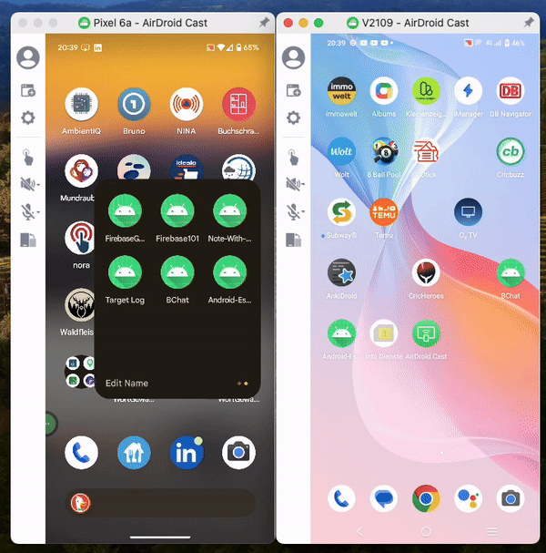

Welcome to the BChat-chat-via-bluetooth---Android-App wiki!


# BChat 

## Bluetooth Chat App
A Bluetooth-based Android application developed in Kotlin that allows two mobile devices to connect, pair, and exchange messages. This project demonstrates my expertise in Android development, utilizing the Android Bluetooth Adapter for device discovery, pairing, and communication.

## Badges

### Table of Contents

* [Overview](#bchat)
* [Features](#features)
* [Demo](#demo)
* [Setup](#setup)
* [How It Works](#how-it-works)
* [Design Patterns & Architecture](#design-patterns--architecture)
* [Tech Stack](#tech-stack)
* [Contributing](#contributing)

### Features

Device Scanning: Search for nearby Bluetooth devices.
Pre-Paired Devices: View and connect to devices that are already paired.
Real-Time Messaging: Send and receive messages between two connected devices.
Kotlin Coroutines: Used for asynchronous operations during device discovery and connection.
Bluetooth Adapter Integration: Utilizes the Android Bluetooth Adapter API for communication.

### Demo
<div style="display: flex; align: center;">
    
</div>

### Setup

To run this project, follow these steps:

1. Clone the repository:
 
   ```https://github.com/nazmos-sakib/BChat-chat-via-bluetooth---Android-App/```

2. Open the project in Android Studio.
3. Build the project:
   * Make sure the required SDK versions are installed.
   * The app targets Android SDK 34 and uses Kotlin 1.5.1. and Java version 17
4. Run the app on two devices:
   * Install the app on two Android devices.
   * Ensure Bluetooth is enabled on both devices.


### How It Works

1. Bluetooth Setup:
   * The app uses the Android BluetoothAdapter class to interact with the Bluetooth hardware.
   * Permissions for Bluetooth and Bluetooth Admin are required in the AndroidManifest.xml:
xml

     ```
     <uses-permission android:name="android.permission.BLUETOOTH" android:maxSdkVersion="30"/>
     <uses-permission android:name="android.permission.BLUETOOTH_SCAN" android:usesPermissionFlags="neverForLocation" tools:targetApi="s" />
     <uses-permission android:name="android.permission.BLUETOOTH_CONNECT" />
     <uses-feature android:name="android.hardware.bluetooth" />
     ```
2. Device Discovery:
   * The app scans for nearby Bluetooth devices using:

     ```
        val bluetoothAdapter: BluetoothAdapter? = BluetoothAdapter.getDefaultAdapter()
        bluetoothAdapter?.startDiscovery()
     ```
   * Results are filtered and shown in a LazyColumn.
3. Pairing & Connecting:
   * For pre-paired devices, the app retrieves the list via:
     ```
     val pairedDevices: Set<BluetoothDevice>? = bluetoothAdapter?.bondedDevices
     ```
   * For new devices, the app initiates pairing and listens for connection events.
4. Message Transfer:
   * The app creates a BluetoothSocket for communication between devices and transfers data via Input/Output streams:
     ```
      val socket = device.createRfcommSocketToServiceRecord(uuid)
      socket.connect()
     ```
   * Messages are serialized into bytes and sent over the connection:
     ```
     val outputStream: OutputStream = socket.outputStream
     outputStream.write(messageBytes)
     ```
5. Error Handling:
   * The app handles common Bluetooth connection errors, such as timeouts and failed pairing.


### Design Patterns & Architecture

### MVVM (Model-View-ViewModel)

The MVVM (Model-View-ViewModel) pattern is used in this project to cleanly separate the user interface (UI) from the business logic, making the app easier to maintain and test. Here's how each layer contributes to the app:

* **Model**: Contains the data-related logic, such as device discovery and Bluetooth connection handling. This layer interacts with the Android Bluetooth Adapter API to manage Bluetooth devices and connections.
* **ViewModel**: Acts as the bridge between the Model and the View. It holds UI-related data that survives configuration changes (like screen rotations). In this app, the ViewModel manages:
  
   * Device scanning results.
The list of paired devices.
Connection statuses and messaging logic.
The ViewModel uses LiveData to expose data to the View, allowing the app to respond to changes without requiring manual updates.
   
   * View: This represents the UI, including the activities and fragments. The View observes the ViewModel for changes and updates the UI accordingly. It doesn’t handle any business logic, making it easier to keep the UI layer clean and focused only on presenting the data.
This approach ensures that the app’s business logic is decoupled from the UI, which makes the code more maintainable and testable.


### Clean Architecture

The project is built following Clean Architecture principles, which helps to ensure a clear separation of concerns. Clean Architecture divides the codebase into multiple layers, allowing for a modular and scalable application. Here’s how Clean Architecture is applied in this project:

1. **Domain Layer**: This is the core of the application. It contains the business logic, including entities (such as Bluetooth device data) and use cases (e.g., "scan for devices," "connect to a device"). The domain layer is independent of any frameworks, UI, or data sources, making it reusable and testable.

2. **Data Layer**: The data layer contains repositories that implement the business logic defined in the domain layer. It manages data retrieval and communication with external systems (in this case, the Android Bluetooth Adapter API). By using repositories, the data layer abstracts away the details of the data sources, making the domain layer completely unaware of how data is fetched or stored.

3. **Presentation Layer**: This includes the ViewModels and UI components. The ViewModel communicates with the domain layer to retrieve or manipulate data and then provides this data to the UI layer. The UI layer (View) observes the ViewModel and updates itself automatically when the data changes, thanks to LiveData.


### Tech Stack

   * **MVVM** Architecture: Used for separating concerns between the UI and business logic.
   * **Kotlin**: Modern programming language for Android development.
   * **Android Bluetooth Adapter**: For device discovery, pairing, and message transfer.
   * **Android Studio**: Development environment.
   * **Coroutines**: For managing asynchronous Bluetooth operations.
   * **Jetpack compose**: UI is implement with jetpack composer.
   * **Dagger-Hilt**: provides a standard way for dependency injection into the application.

### Contributing

Contributions are welcome! Please feel free to submit a Pull Request or open an Issue if you find any bugs or have feature requests.
